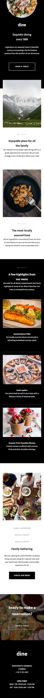
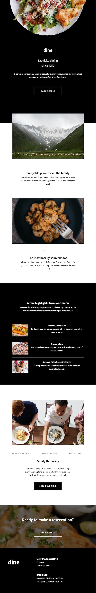
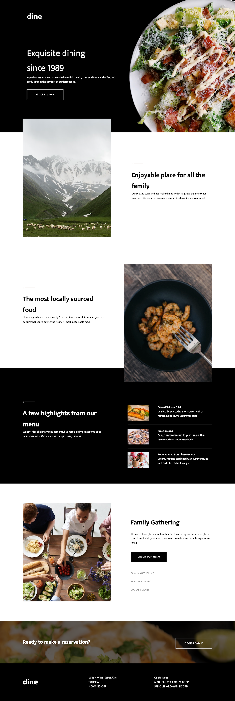
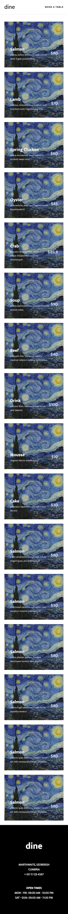
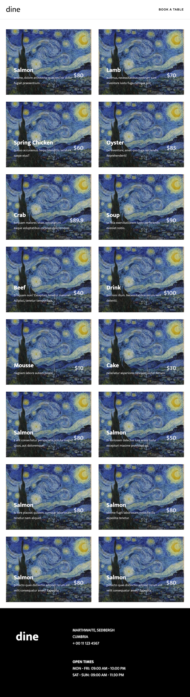
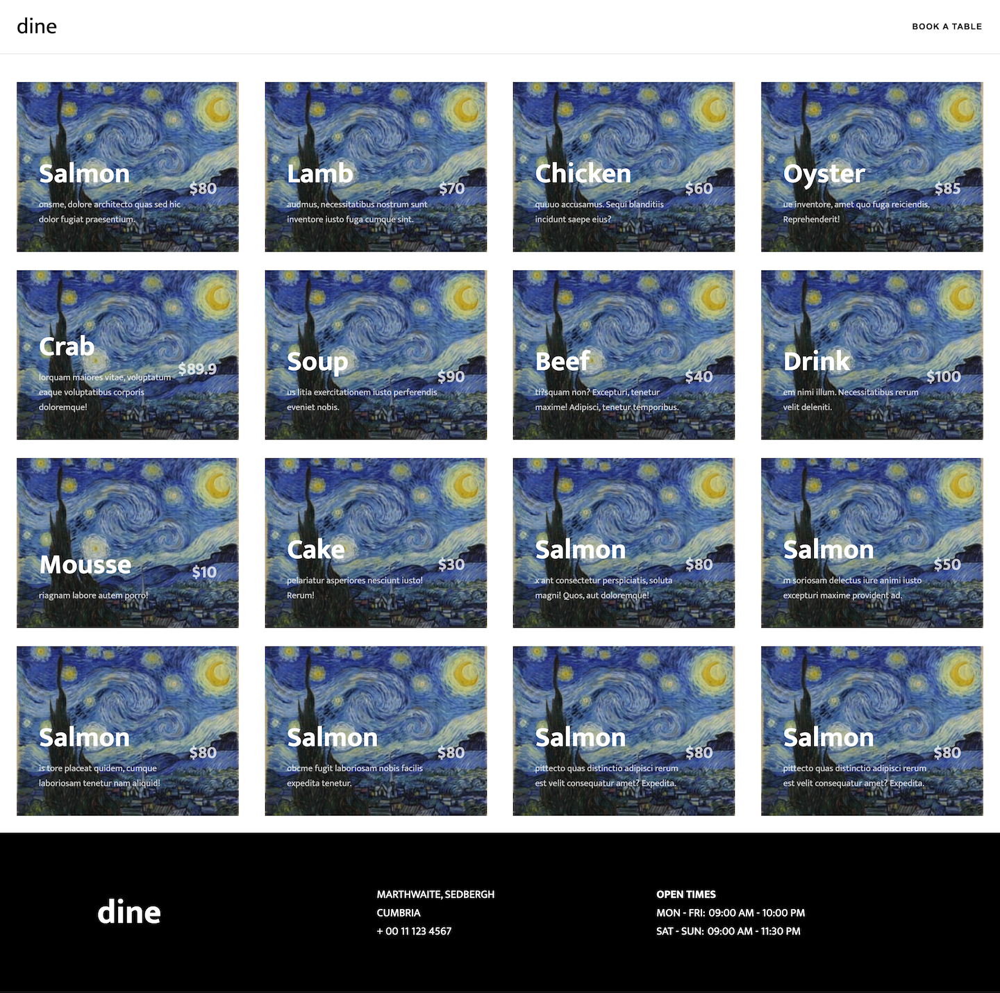
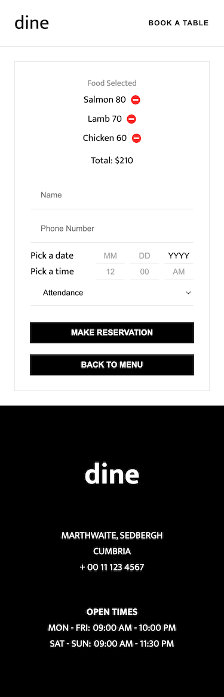
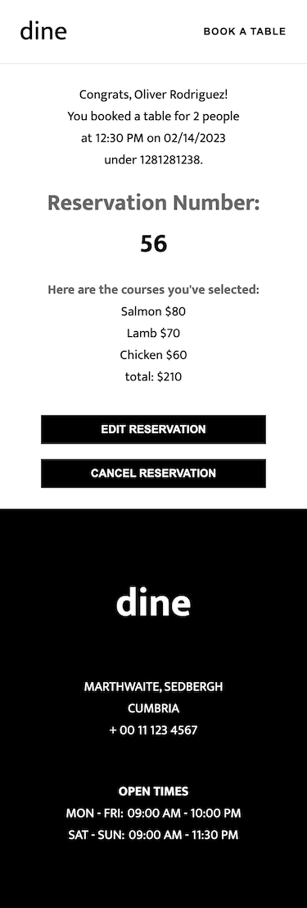

# Restaurant App

A simple restaurant app with basic CRUD functions.

## Table of contents

- [Restaurant App](#restaurant-app)
  - [Table of contents](#table-of-contents)
  - [Overview](#overview)
    - [The challenge](#the-challenge)
    - [Screenshot](#screenshot)
    - [Links](#links)
  - [My process](#my-process)
    - [Built with](#built-with)
    - [Setup](#setup)
    - [What I learned](#what-i-learned)
    - [Continued development](#continued-development)
    - [Useful resources](#useful-resources)
  - [Author](#author)
  - [Acknowledgments](#acknowledgments)

## Overview

### The challenge

Users should be able to:

- View the optimal layout for the site depending on their device's screen size
- See hover states for all interactive elements on the page

### Screenshot




I used the same image because build backend hasn't been built yet.






### Links

- Landing Page Prototype: [Dine restaurant website](https://www.frontendmentor.io/challenges/dine-restaurant-website-yAt7Vvxt7)
- Menu prototype: [Galleria slideshow site](https://www.frontendmentor.io/challenges/galleria-slideshow-site-tEA4pwsa6)

## My process

### Built with

- Semantic HTML5 markup
- CSS custom properties
- Flexbox
- CSS Grid
- Mobile-first workflow
- Responsive design
- JSON Server
- [React](https://reactjs.org/) - JS library
- [React Router](https://reactrouter.com/en/main) 
- [SASS](https://sass-lang.com/) - For styles
- [BEM](https://getbem.com/) - For reusable components

### Setup

- Delete all the folders except App.js, index.css and index.js.
  (Make sure the ES7 snippets extention has been installed to vscode.)
- Add dependencies:
  yarn add react-router-dom react-icons axios
  yarn add sass -D
- Use React Router to build multiple pages app
- Set up the static part(HTML) components
- Render the page with SCSS
- Write CRUD functions
- Start react app: 
```zsh
yarn start
```
- Start json-server: 
```zsh
json-server --watch data/db.json --port 3500
```

### What I learned

1. Q: Image does not display in React app. A: use require to wrap the src string.
```html

```

2. How to make basic shapes with svg using an online editor(https://editor.method.ac/) and insert the svg code directly into the html code.
   
3. How to make a background-color stops at a certain location?
If two or more color stops are at the same location, the transition will be a hard line between the first and last colors declared at that location.
```css
background: linear-gradient(to right, #000 40%, #4d4d4d 30%, #4d4d4d 65%);
```

4. How to set images as the background of the figcations?
Use absolute positioning on the figcations, and set the width of the images to 100%.
```scss
&__figure {
    position: relative;
    margin: 0;
  }

&__figcaption {
  color: #fff;
  position: absolute;
  left: u.rem(32);
  bottom: u.rem(36);
}

&__image {
  width: 100%;
  margin: 0;
}
```

5. How to make images grow depending on the window size?
Add rule 'display: flex' to both the parent and grandparent of the figures, and set the flex-grow of their parent element to 1.
```scss
.menu {
  display: flex;

    &__ul {
      display: flex;
      flex-grow: 1;
      flex-flow: column wrap;
      flex-direction: column;
      gap: u.rem(24);
      justify-content: center;
      align-content: center;
  }
}
```

6. How to mask images on hover?
Set the background-color of the images' parent to #fff, and set the opacity of image:hover to 0.5.
```scss
&__figure {
  background-color: #fff;
}
&__image:hover {
  opacity: 0.5;
}
```

7. Check if a date is weekend
```js
const isWeekend = (date) => {
  const newDate = new Date(date);
  return newDate.getDay() === 6 || newDate.getDay() === 0;
}
console.log(isWeekend('1996-11-07'));
```

8. Check how manys days a specific month has.
```js
const getDays = (year, month) => {
    return new Date(year, month, 0).getDate();
}
console.log(getDays('2023', '02'));
```

9. How to customize a timePicker.
    
10. Something about react hooks.
Render loop:
When we update the state => the component re-renders => it creates a new value => calls useEffect => updates the state
solution: useCallback()

difference between useMemo and useEffect:
useMemo() returns the value of the function. It can cache a value, so we don't have to recomputed every single time.
useCallback() returns the entire function. If we need to worry about referential equality, we can use this hook.

About React Hooks
They can only be used in the function components.
React hooks must be called in the exact same order in every component render.

11. To Prevent Margin Collapsing, we can add a border to the element.

### Continued development

- Add segments effect to the eventCard ul.
- Add Responsive design to book and order page.
- Add dark mode.
- Build a backend in order to upload pictures to menu page.
- Add multi language feature.
- Keep optimizing this App.

### Useful resources

- [MDN](https://developer.mozilla.org/en-US/) 
- [Pexels](https://www.pexels.com/) - This helped me for XYZ reason. I really liked this pattern and will use it going forward.
- [Google Fonts](https://fonts.google.com/) - This is an amazing article which helped me finally understand XYZ. I'd recommend it to anyone still learning this concept.
- [Method Draw Vector Editor](https://editor.method.ac/)
- [RegExr](https://regexr.com/)
  
## Author

- Website - [Oliver C.](https://github.com/iberis9611)
- Frontend Mentor - [@iberis9611](https://www.frontendmentor.io/profile/iberis9611)

## Acknowledgments
